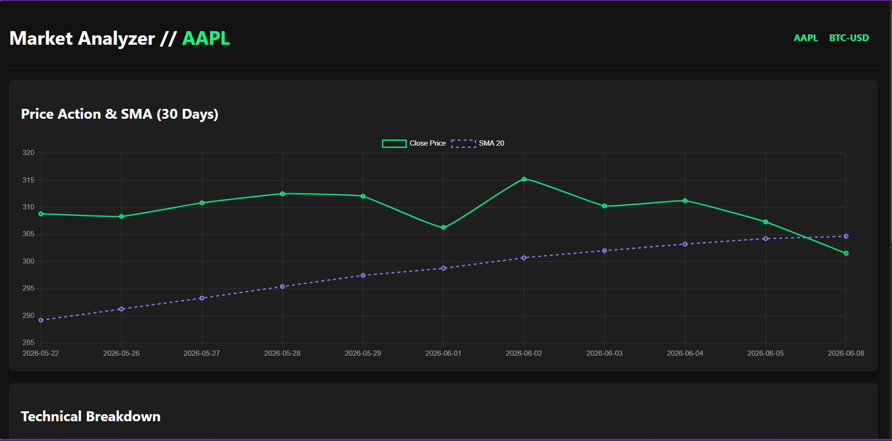

# 📈 Automated Stock & Crypto Analyzer

A full-stack Django web application that automatically ingests financial data, calculates key technical indicators using Pandas and NumPy, and visualizes the results on a modern, dark-themed dashboard.

**Live Demo:** [Click here to view the live dashboard](https://stock-crypto-analyzer.onrender.com/)



---

## ✨ Features

- **Automated Data Ingestion:** Fetches reliable, up-to-date market history for stocks and cryptocurrencies using the `yfinance` API.
- **Financial Data Engine:** Utilizes **Pandas** and **NumPy** to process raw data and calculate advanced metrics, including:
  - Simple Moving Averages (20-day and 50-day SMA)
  - Relative Strength Index (14-day RSI)
  - Daily Percentage Returns
- **Interactive Visualizations:** Renders responsive, dynamic line charts using **Chart.js** to track price action alongside moving averages.
- **Web-Triggered Automation:** Features a custom Django Management Command and a secure webhook endpoint to allow seamless daily data updates via third-party Cron services without server access.
- **Production Ready:** Configured with `Gunicorn` and `Whitenoise` for fast, secure, and reliable deployment on cloud platforms like Render.

---

## 🛠️ Tech Stack

| Layer | Technology |
|---|---|
| Backend | Python, Django |
| Data Science | Pandas, NumPy |
| APIs | yfinance (Yahoo Finance) |
| Frontend | HTML5, CSS3, Chart.js |
| Database | SQLite (Development) |
| Deployment | Render, Gunicorn, Whitenoise |

---

## 🚀 Local Setup & Installation

To run this project locally on your Windows machine, follow these steps:

**1. Clone the repository**
```bash
git clone https://github.com/SKEL1NJA/stock-crypto-analyzer.git
cd stock-crypto-analyzer
```

**2. Create and activate a virtual environment**
```powershell
python -m venv venv
.\venv\Scripts\Activate.ps1
```

**3. Install dependencies**
```powershell
pip install -r requirements.txt
```

**4. Run database migrations**
```powershell
python manage.py migrate
```

**5. Start the local server**
```powershell
python manage.py runserver
```

> Visit `http://127.0.0.1:8000/` in your browser.